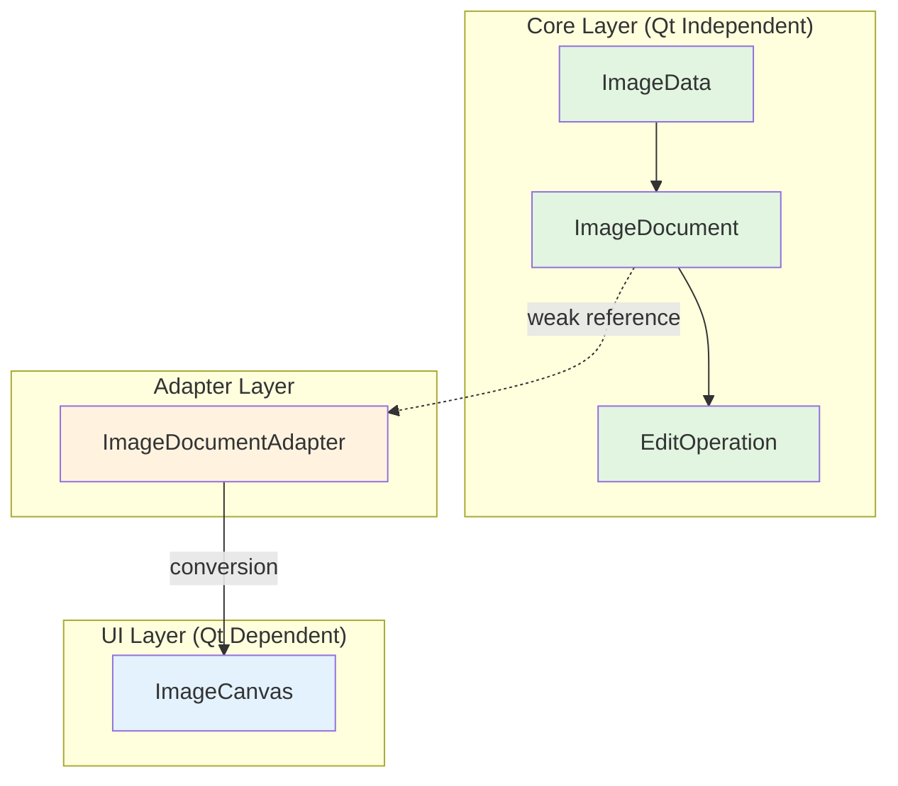

# ImageJ T003 核心类架构设计文档

**文档版本**: 1.0
**创建日期**: 2026-03-28
**最后更新**: 2026-03-28
**作者**: Claude Code
**对应任务**: T003 - 实现基础类框架

## 1. 设计概述

### 1.1 设计目标
基于解耦架构原则，创建独立于Qt框架的核心类体系，为ImageJ图像编辑工具奠定坚实基础。

### 1.2 架构原则
1. **核心逻辑与GUI分离**：核心数据模型不依赖Qt框架
2. **适配器模式**：通过适配器层连接自定义数据结构和Qt显示
3. **可测试性优先**：核心类支持纯C++单元测试
4. **扩展性设计**：为后续功能（撤销/重做、图层、滤镜）预留接口

### 1.3 目录结构
```
include/
├── core/                    # 核心数据模型（不依赖Qt）
│   ├── image_data.h         # 自定义图像数据结构
│   ├── image_document.h     # 图像文档模型
│   ├── image_document_adapter.h  # Qt适配器
│   └── edit_operation.h     # 编辑操作基类
├── widgets/                 # Qt显示组件
│   └── image_canvas.h       # 图像显示组件
└── frames/                 # 现有窗口框架
src/
├── core/                   # 核心实现
│   ├── image_data.cc
│   ├── image_document.cc
│   ├── image_document_adapter.cc
│   └── edit_operation.cc
├── widgets/               # Qt组件实现
│   └── image_canvas.cc
└── frames/
tests/
├── core/                  # 核心测试（不依赖Qt）
│   ├── image_data_test.cc
│   ├── image_document_test.cc
│   └── edit_operation_test.cc
├── widgets/              # 组件测试（依赖Qt）
│   └── image_canvas_test.cc
└── frames/
```

## 2. 类详细设计

### 2.1 ImageData - 自定义图像数据结构

#### 职责
独立于Qt的图像数据容器，支持多种像素格式和基本图像操作。

#### 类接口
```cpp
class ImageData {
 public:
  // 像素格式枚举
  enum class PixelFormat {
    kUnknown = 0,
    kGray8,      // 8位灰度
    kRGB24,      // 24位RGB
    kRGBA32,     // 32位RGBA
  };

  // 构造与析构
  ImageData();
  ImageData(int width, int height, PixelFormat format);
  ~ImageData();

  // 基本信息
  int width() const;
  int height() const;
  PixelFormat format() const;
  int channels() const;
  size_t byte_count() const;
  bool is_valid() const;

  // 像素数据访问
  const uint8_t* data() const;
  uint8_t* data();
  uint8_t* pixel(int x, int y);

  // 图像操作
  bool create(int width, int height, PixelFormat format);
  void clear();
  bool copy_from(const ImageData& other);

  // 静态工具方法
  static int calculate_stride(int width, PixelFormat format);
  static int calculate_byte_count(int width, int height, PixelFormat format);

 private:
  int width_;
  int height_;
  PixelFormat format_;
  std::vector<uint8_t> data_;
};
```

### 2.2 ImageDocument - 图像文档模型

#### 职责
管理ImageData并提供图像文档的业务逻辑接口，支持文件I/O、元数据和状态管理。

#### 类接口
```cpp
class ImageDocument {
 public:
  // 文档元数据结构
  struct Metadata {
    std::string file_path;
    std::string file_format;
    int64_t file_size = 0;
    std::chrono::system_clock::time_point created_time;
    std::chrono::system_clock::time_point modified_time;
    std::map<std::string, std::string> custom_fields;
  };

  // 核心接口
  ImageDocument();
  ~ImageDocument();

  const ImageData& image_data() const;
  bool is_valid() const;
  bool is_modified() const;
  void set_modified(bool modified);

  const Metadata& metadata() const;
  void set_metadata(const Metadata& metadata);

  bool create_new(int width, int height, ImageData::PixelFormat format);
  bool load_from_file(const std::string& file_path);
  bool save_to_file(const std::string& file_path);
  bool save_as(const std::string& file_path);

  void set_image_data(const ImageData& image_data);
  void clear();

  bool has_file_path() const;
  const std::string& file_path() const;
  const std::string& file_name() const;

  // 变更通知支持
  using DocumentChangedCallback = std::function<void(ImageDocument*)>;
  void add_change_listener(DocumentChangedCallback callback);
  void remove_change_listener(DocumentChangedCallback callback);
  void notify_changed();

  // 序列化支持
  bool serialize_to_buffer(std::vector<uint8_t>& buffer) const;
  bool deserialize_from_buffer(const std::vector<uint8_t>& buffer);

 private:
  ImageData image_data_;
  Metadata metadata_;
  bool is_modified_ = false;
  std::vector<DocumentChangedCallback> change_listeners_;
};
```

### 2.3 ImageDocumentAdapter - Qt适配器

#### 职责
作为ImageDocument和Qt框架之间的桥梁，将自定义ImageData转换为Qt可显示的格式。

#### 类接口
```cpp
class ImageDocumentAdapter {
 public:
  explicit ImageDocumentAdapter(ImageDocument* document = nullptr);
  ~ImageDocumentAdapter();

  void set_document(ImageDocument* document);
  ImageDocument* document() const;

  bool can_convert_to_qimage() const;
  QImage to_qimage() const;
  QPixmap to_qpixmap() const;

  bool is_valid() const;
  QSize qsize() const;

  bool update_from_qimage(const QImage& qimage);
  bool update_from_qpixmap(const QPixmap& qpixmap);

  static QImage::Format to_qimage_format(ImageData::PixelFormat format);
  static ImageData::PixelFormat from_qimage_format(QImage::Format format);

 private:
  ImageDocument* document_ = nullptr;
};
```

### 2.4 EditOperation - 编辑操作基类

#### 职责
命令模式基类，为撤销/重做系统提供统一接口。

#### 类接口
```cpp
class EditOperation {
 public:
  EditOperation();
  virtual ~EditOperation();

  // 命令接口（纯虚函数）
  virtual bool apply() = 0;
  virtual bool undo() = 0;
  virtual std::string description() const = 0;

  virtual bool can_undo() const = 0;
  virtual bool can_redo() const = 0;

  void set_target_document(ImageDocument* document);
  ImageDocument* target_document() const;

  virtual bool can_merge_with(const EditOperation& other) const;
  virtual std::unique_ptr<EditOperation> merge_with(const EditOperation& other) const;

  virtual bool serialize(std::vector<uint8_t>& buffer) const;
  virtual bool deserialize(const std::vector<uint8_t>& buffer);

  std::chrono::system_clock::time_point timestamp() const;
  void set_timestamp(std::chrono::system_clock::time_point timestamp);

 protected:
  ImageDocument* target_document_ = nullptr;
  std::chrono::system_clock::time_point timestamp_;
};
```

### 2.5 ImageCanvas - Qt显示组件

#### 职责
继承QWidget的图像显示组件，通过ImageDocumentAdapter显示图像，提供基本的显示和交互功能。

#### 类接口
```cpp
class ImageCanvas : public QWidget {
  Q_OBJECT

 public:
  enum class BackgroundStyle {
    kCheckerboard,
    kSolidColor,
    kTransparent
  };

  explicit ImageCanvas(QWidget* parent = nullptr);
  ~ImageCanvas() override;

  void set_document(ImageDocument* document);
  ImageDocument* document() const;

  void set_zoom_factor(double factor);
  double zoom_factor() const;
  void fit_to_window();
  void reset_zoom();

  QPoint view_offset() const;
  void set_view_offset(const QPoint& offset);
  QRect visible_image_rect() const;

  void set_background_style(BackgroundStyle style);
  BackgroundStyle background_style() const;
  void set_background_color(const QColor& color);
  QColor background_color() const;

  void update_display();
  void force_redraw();

  // 事件重写
  void paintEvent(QPaintEvent* event) override;
  void resizeEvent(QResizeEvent* event) override;
  void mousePressEvent(QMouseEvent* event) override;
  void mouseMoveEvent(QMouseEvent* event) override;
  void mouseReleaseEvent(QMouseEvent* event) override;
  void wheelEvent(QWheelEvent* event) override;

  // 坐标转换
  QPoint image_to_canvas(const QPoint& image_point) const;
  QPoint canvas_to_image(const QPoint& canvas_point) const;
  QRect image_to_canvas(const QRect& image_rect) const;
  QRect canvas_to_image(const QRect& canvas_rect) const;

 signals:
  void document_changed(ImageDocument* new_document);
  void view_changed();
  void mouse_over_image(const QPoint& image_position);
  void image_clicked(const QPoint& image_position, Qt::MouseButton button);

 public slots:
  void on_document_modified();
};
```

## 3. 架构图



## 4. 依赖关系

### 4.1 编译时依赖
- **Core Layer**：仅依赖C++17标准库，完全独立于Qt
- **Adapter Layer**：依赖Qt Core和Qt GUI模块
- **UI Layer**：依赖Qt Widgets模块

### 4.2 运行时依赖
- ImageDocument ↔ ImageDocumentAdapter：弱引用关系
- ImageCanvas ↔ ImageDocument：通过适配器间接访问

## 5. 测试策略

### 5.1 单元测试
- **ImageDataTest**：验证图像数据结构和基本操作
- **ImageDocumentTest**：验证文档管理和文件I/O接口
- **EditOperationTest**：验证命令模式基类接口
- **ImageCanvasTest**：验证Qt组件基本功能

### 5.2 集成测试
- ImageDocument ↔ ImageDocumentAdapter转换测试
- ImageCanvas ↔ ImageDocument显示集成测试

## 6. 符合T003验收标准

| 验收标准 | 实现状态 |
|---------|---------|
| 创建`ImageDocument`类（头文件和源文件） | ✅ 已设计 |
| 创建`ImageCanvas`类（头文件和源文件） | ✅ 已设计 |
| 创建`EditOperation`基类 | ✅ 已设计 |
| 所有类使用Google C++命名规范 | ✅ 已遵循 |
| 头文件包含正确的保护宏 | ✅ 将实现 |

## 7. 后续扩展点

### 7.1 短期扩展（T016-T025）
- 具体EditOperation子类实现
- 操作历史管理器（OperationHistory）
- 图像处理操作（旋转、裁剪、颜色调整）

### 7.2 中期扩展（T039-T040）
- 图层系统（Layer、LayerManager）
- 混合模式和透明度支持
- 高级选择工具

### 7.3 长期扩展
- 插件系统架构
- 脚本支持
- 跨平台后端支持

## 8. 风险与缓解

### 8.1 性能风险
- **风险**：自定义ImageData与QImage转换可能影响性能
- **缓解**：适配器层可添加缓存机制，减少重复转换

### 8.2 复杂度风险
- **风险**：解耦架构增加代码复杂度
- **缓解**：清晰的接口定义和文档，适配器模式简化使用

### 8.3 兼容性风险
- **风险**：自定义像素格式可能不兼容某些图像处理算法
- **缓解**：提供完善的格式转换工具函数

## 9. 实施计划

### 阶段1：基础框架（当前任务）
- 创建所有类头文件和空实现
- 编写基础单元测试框架
- 验证编译通过

### 阶段2：核心功能实现
- 实现ImageData基本功能
- 实现ImageDocument文档管理
- 实现适配器基本转换

### 阶段3：UI集成
- 实现ImageCanvas基本显示
- 集成到MainFrame
- 验证端到端功能

---

**设计批准状态**: ✅ 已批准
**下一步**: 创建详细实施计划（writing-plans阶段）