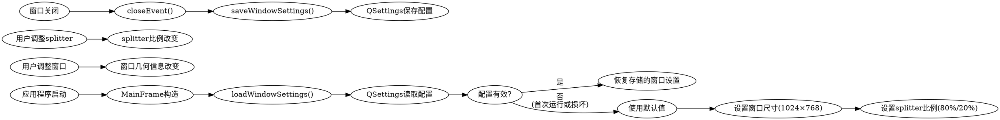

# MainFrame主窗口实现设计

> **For agentic workers:** REQUIRED: Use superpowers:subagent-driven-development (if subagents available) or superpowers:executing-plans to implement this plan. Steps use checkbox (`- [ ]`) syntax for tracking.

**Goal:** 完善MainFrame主窗口，实现基本布局和窗口管理，支持配置持久化

**Architecture:** QSplitter分隔左右区域（ImageCanvas左侧80%，RightSidebar右侧20%），使用QSettings存储窗口几何信息和布局配置

**Tech Stack:** C++17, Qt6, Google C++ Style Guide, Google Test

---

## 1. 需求分析

### 1.1 功能需求
- MainFrame正确显示并可以调整大小
- 实现基本的垂直/水平布局
- 包含图像显示区域（ImageCanvas占位）
- 包含右侧边栏区域（RightSidebar占位，显示"工具选项"）
- 窗口标题正确显示"ImageJ"
- 支持配置持久化（窗口位置、大小、布局比例）

### 1.2 非功能需求
- **性能**: 窗口响应迅速，无闪烁
- **可用性**: 支持拖拽调整左右区域宽度
- **可维护性**: 代码符合Google C++规范，有单元测试
- **错误处理**: 配置加载失败时回退到默认值

## 2. 架构设计

### 2.1 方案选择：QSplitter + 基础布局（方案A）
- **结构**: MainFrame继承QWidget，包含QSplitter作为主布局
- **左侧**: ImageCanvas组件，初始宽度80%
- **右侧**: RightSidebar组件，显示"工具选项"标签，初始宽度20%
- **配置**: QSettings存储窗口几何信息和splitter状态

### 2.2 类设计

#### MainFrame类 (`include/frames/main_frame.h`)
```cpp
class QSplitter;
class QSettings;

class MainFrame : public QWidget {
    Q_OBJECT
public:
    explicit MainFrame(QWidget* parent = nullptr);
    ~MainFrame() override;

protected:
    void closeEvent(QCloseEvent* event) override;

private:
    void buildUi();
    void connectSignals();
    void loadWindowSettings();
    void saveWindowSettings();

    QSplitter* splitter_;
    ImageCanvas* image_canvas_;
    RightSidebar* right_sidebar_;
    QSettings* settings_;
};
```

#### RightSidebar类 (`include/frames/right_sidebar.h`)
```cpp
class QLabel;
class QVBoxLayout;

class RightSidebar : public QWidget {
    Q_OBJECT
public:
    explicit RightSidebar(QWidget* parent = nullptr);

private:
    void buildUi();

    QLabel* placeholder_label_;
    QVBoxLayout* main_layout_;
};
```

### 2.3 配置系统设计

#### 存储位置
- **QSettings组织**: `QSettings("ImageJ", "ImageJ")`
- **数据分组**: [Window], [Layout]

#### 存储数据
```ini
[Window]
geometry=@ByteArray(...)      # 窗口几何信息
windowState=@ByteArray(...)   # 窗口状态（最大化/正常）

[Layout]
splitterSizes=@ByteArray(...) # QSplitter分割比例
```

#### 默认值定义
```cpp
constexpr int DEFAULT_WIDTH = 1024;
constexpr int DEFAULT_HEIGHT = 768;
constexpr int DEFAULT_SPLIT_RATIO = 8; // 80% : 20% 比例
constexpr char DEFAULT_TITLE[] = "ImageJ";
```

### 2.4 数据流



## 3. 错误处理策略

### 3.1 可恢复错误
1. **QSettings加载失败**: 回退到默认值，使用qWarning()记录
2. **QSplitter创建失败**: 使用QHBoxLayout作为后备方案
3. **组件创建失败**: 显示错误标签，应用仍可运行

### 3.2 不可恢复错误
1. **内存分配失败**: 抛出std::bad_alloc，由调用者处理
2. **Qt资源初始化失败**: 显示错误对话框后退出

### 3.3 日志记录
- **qDebug()**: 配置加载状态、UI构建进度
- **qWarning()**: 可恢复错误（配置损坏、组件创建失败）
- **qCritical()**: 不可恢复错误（内存不足、Qt初始化失败）

## 4. 测试策略

### 4.1 单元测试范围

#### MainFrame测试 (`tests/main_frame_test.cc`)
```cpp
// 需要重新启用该测试文件（移除.disabled后缀）
TEST(MainFrameTest, DefaultWindowSize) {
    // 验证首次运行时的默认窗口尺寸(1024×768)
}

TEST(MainFrameTest, LayoutCreation) {
    // 验证QSplitter和子组件正确创建
    // 验证ImageCanvas和RightSidebar非空
}

TEST(MainFrameTest, SettingsPersistence) {
    // 验证配置保存和恢复功能
    // 模拟窗口调整和splitter调整
}

TEST(MainFrameTest, WindowTitle) {
    // 验证窗口标题正确设置为"ImageJ"
}
```

#### RightSidebar测试 (`tests/right_sidebar_test.cc`)
```cpp
TEST(RightSidebarTest, PlaceholderText) {
    // 验证右侧边栏显示"工具选项"标签
}

TEST(RightSidebarTest, LayoutStructure) {
    // 验证QVBoxLayout正确设置
}
```

### 4.2 测试工具
- **Google Test**: 单元测试框架
- **QTest**: Qt特定功能测试
- **Mock QSettings**: 隔离配置系统测试（使用测试专用配置）

## 5. 实现优先级与阶段划分

### 阶段1：核心框架（必须完成）
1. MainFrame使用QSplitter布局
2. RightSidebar显示"工具选项"标签
3. 窗口基本显示（1024×768，标题"ImageJ"）

### 阶段2：配置系统（重要）
1. QSettings集成
2. 配置加载/保存逻辑
3. 错误处理与日志记录

### 阶段3：测试覆盖（质量保证）
1. 核心功能单元测试
2. 配置持久化测试
3. 错误处理测试

## 6. 验收标准

### 6.1 功能验收
- [ ] MainFrame窗口正确显示，可调整大小
- [ ] 初始窗口尺寸为1024×768
- [ ] 窗口标题显示"ImageJ"
- [ ] 左侧ImageCanvas区域占80%宽度
- [ ] 右侧RightSidebar区域占20%宽度，显示"工具选项"
- [ ] 支持拖拽调整左右区域宽度
- [ ] 窗口关闭后重新打开，布局配置自动恢复

### 6.2 质量验收
- [ ] 代码符合Google C++编码规范
- [ ] 有完整的单元测试，测试通过率100%
- [ ] 错误处理完善，配置损坏时可回退到默认值
- [ ] 无内存泄漏（Valgrind检测通过）
- [ ] 编译无警告

## 7. 技术依赖

### 7.1 已完成依赖
- **T001**: CMake配置 ✓
- **T002**: 目录结构 ✓
- **T003**: 基础类框架 ✓
  - ImageDocument类 ✓
  - ImageCanvas类 ✓
  - EditOperation基类 ✓

### 7.2 本任务依赖
- **T003**: 基础类框架（已完成，可直接使用）

## 8. 已知限制与假设

### 8.1 已知限制
1. **RightSidebar功能有限**: 当前仅显示占位文本，完整工具面板需后续任务实现
2. **配置版本控制**: 当前设计不支持配置格式版本迁移
3. **多显示器支持**: 窗口位置恢复可能不适用于多显示器配置变更

### 8.2 设计假设
1. **用户期望简化风格**: 默认80%/20%比例符合简化编辑器使用模式
2. **配置持久化有价值**: 用户希望应用记住窗口布局
3. **错误恢复优先于精确**: 配置损坏时回退默认值优于应用崩溃

---

*设计文档版本: 1.0*
*创建日期: 2026-03-28*
*更新日期: 2026-03-28*
*设计者: Claude Code*

*注意: 此设计基于"简化编辑器风格"原则，专注于核心窗口管理功能，避免过度设计。*